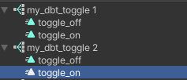

# Sub Asset Tool for VRChat package manager

This tool allows editing of the sub assets (or objects) contained within a single asset file on disk.

For easier browsing and installation visit the [GitHub Pages Site](https://konsti219.github.io/vcc-tools/).

## Use cases

- Organise your files by keeping related assets in one main asset.
  For example you can include the animations that a blendtree uses in the blendtree asset.
  This also avoids cluttering your folders with too many files because you can hide all the sub assets easily.

- Created a blendtree using `From New Blend Tree` in an animator but now you want it as a seperate asset?
  You can use this tool to extract the blendtree.

## Features

- View sub assets
- Change sub asset visibility
- Rename sub assets
- Extract sub assets
- Remove sub assets
- Re add removed sub assets to other assets
